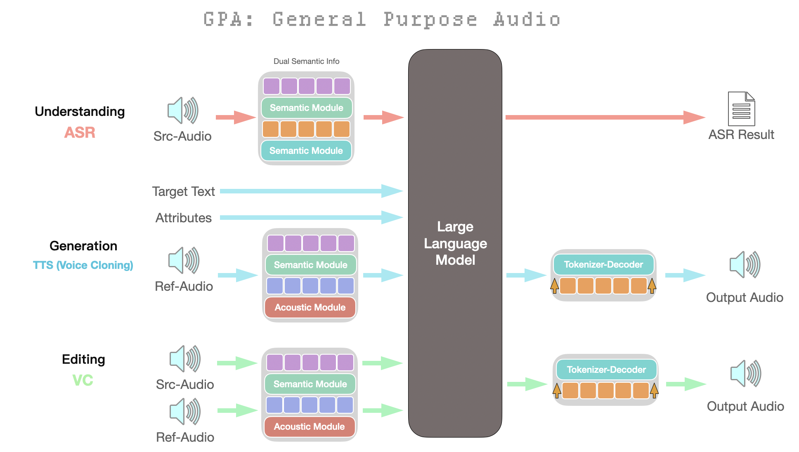

<div align="center">
  

# GPA: One Model for Speech Recognition, Text-to-Speech, and Voice Conversion

[](https://arxiv.org/abs/2601.10770) [](https://autoark.github.io/GPA/) [](https://huggingface.co/AutoArk-AI/GPA) [](https://demo.autoark.com) [](https://www.modelscope.cn/models/AutoArk/GPA)

</div>

> **TL;DR** GPA incorporates three speech tasks into one single model and this repo includes codes of training, fine-tuning and effecient deployment of GPA.

## 📖 Abstract

**GPA** stands for **General Purpose Audio**. 

In academia, a student’s GPA (Grade Point Average) serves as a unified metric that reflects performance across diverse subjects—ranging from Calculus and Philosophy to Gym class.

Similarly, our GPA model unifies the three major pillars of audio tasks—Text-to-Speech (TTS), Automatic Speech Recognition (ASR), and Voice Conversion (VC)—into a single auto-regreesive transformer.
*   Our open-source content includes support for multiple frameworks and provides **production-ready code suitable for cloud deployment.**
*   we include concise **inference examples** and **training pipelines** for research purpose.
*   The released 0.3B model is also perfect for **edge devices** and edge deployment is to be released.

## Table of Content

<div align="center">

| [🗺️ Roadmap](#-roadmap) | [🚀 Quick Start](#-quick-start) | [🛠️ Deployment](#-deployment) | [📊 Evaluation](#-model-evaluation-results) | [⚡ Performance](#-model-performance) |
| :---: | :--- | :--- | :---: | :--- |
| | • [Environment Setup](#-environment-setup)<br>• [Checkpoint Download](#-checkpoint-download)<br>• [Inference](#-inference)<br>• [Training](#-training) | • [Start the Service (Docker)](#1-start-the-service-docker)<br>• [Start the Gradio GUI](#2-start-the-gradio-gui)<br>• [Basic Testing](#3-basic-testing) | | • [Speed](#speed)<br>• [RTF](#rtf)<br>• [Concurrency](#concurrency)<br>• [VRAM Usage](#vram-usage) |

</div>

## 🗺️ Roadmap

| Category | Item | Status |
| :--- | :--- | :---: |
| **Core Features** | Unified LLM-based audio generation & understanding | ✅ |
| | Inference Scripts (STT, TTS, VC) | ✅ |
| | Training Pipeline (DeepSpeed) | ✅ |
| | Interactive Demo | ✅ |
| Basic Service Deployment (vLLM/FastAPI) | ✅ |
| Paper (ArXiv) | ✅ |
| **Model Releases** | **GPA-0.3B-preview** (Edge-focused) | ✅ |
| | **GPA-0.3B** (Edge-focused) | ⬜ |
| **Edge Deployment** | Android Platform | ⬜ |
| | RK Series | ⬜ |
| | IOS Platform | ⬜ |
| **Frameworks** | vllm | ✅ |
| | llama-cpp | ✅ |
| | sglang | ✅ |
| | torch | ✅ |
| | mlx-lm | ✅ |
| | rknn | ⬜ |

## 🔍 Model Overview

<div align="center">
  
  <br>
  <div style="text-align: justify; width: 100%; margin: 10px auto; text-indent: 2em;">
    <strong>Figure 1: Architecture of the proposed GPA framework.</strong> The model utilizes a shared Large Language Model (LLM) backbone to unify three core audio tasks: Understanding (ASR), Generation (TTS), and Editing (Voice Conversion). Depending on the task, the model processes different combinations of inputs (Source Audio, Target Text, or Reference Audio) via Semantic and Acoustic modules to generate the corresponding text or audio output.
  </div>
</div>

## 🚀 Quick Start

### 🧹 Environment Setup

#### 🧩 Option A: Reproducible Setup with `uv` (Recommended)

> ### ⚠️ Prerequisites (Important)
>
> *The default development environment is configured for:*
>
> - * **OS**: Linux (x86_64)*
> - * **GPU**: NVIDIA*
> - * **CUDA**: 12.x*
>
> *The provided `uv.lock` file was generated under this configuration.*
>
> *If your system **matches** the above, you can use the `uv`-based setup for a fully reproducible environment.*
>
> *If you are using:*
> - *CUDA 11.x (e.g. cu116)*
> - *CPU-only systems*
> - *macOS or Windows*
>
> *please follow the **pip-based installation** described below.*

We use [`uv`](https://github.com/astral-sh/uv) for fast and reproducible Python environment management.

**1. Install uv**
```bash
curl -LsSf https://astral.sh/uv/install.sh | sh

# Or install via pip if you prefer:
# pip install uv
```

**2. Sync the environment (installs all dependencies)**

> **💡Note**: If training is not required, or if building flash_attn is difficult/slow on your device, you may comment out this dependency in pyproject.toml. Training should be switched to eager mode in such condition.

```bash
uv sync
```

#### 🧩 Option B: Flexible Setup with pip (Any CUDA / CPU)

**1. Create and activate a virtual environment**
```bash
python -m venv .venv
source .venv/bin/activate
```

**2. Install base dependencies**
```bash
pip install -r requirements.txt
```

### 📥 Checkpoint Download

Before running inference, please download the model checkpoints from Hugging Face or ModelScope.

| Model | Hugging Face | ModelScope |
| :--- | :---: | :---: |
| **GPA-0.3B-preview** | [Download](https://huggingface.co/AutoArk-AI/GPA) | [Download](https://www.modelscope.cn/models/AutoArk/GPA) |
| **GPA-0.3B** | Coming Soon | Coming Soon |

> **Important**: After downloading the checkpoints, please verify that your model directory structure matches the hierarchy below. 

```text
${GPA_MODEL_DIR}/
├── BiCodec/
├──── wav2vec2-large-xlsr-53/
├── glm-4-voice-tokenizer/
├── added_tokens.json
├── chat_template.jinja
├── config.json
├── generation_config.json
├── merges.txt
├── model.safetensors
├── special_tokens_map.json
├── tokenizer_config.json
├── tokenizer.json
└── vocab.json
```

### 💭 Inference

You can perform various tasks like **Speech-to-Text**, **Text-to-Speech**, and **Voice Conversion** using the provided scripts.

> **💡Note**: Please navigate to the inference directory to ensure relative paths for audio files work correctly.

> **💡Note**: Currently, we only support input in WAV format at a sample rate of 16 kHz.

```bash
cd scripts/inference
```

> **💡Note**: To use other python environments, replace "uv run" with "path_to_your_python".

Speech-to-Text (STT/ASR):

```bash
# Using uv
uv run gpa_inference.py --task stt \
    --src_audio_path "test_audio/000.wav" \
    --gpa_model_path "${GPA_MODEL_DIR}" \
    --tokenizer_path "${GPA_MODEL_DIR}/glm-4-voice-tokenizer" \
    --bicodec_tokenizer_path "${GPA_MODEL_DIR}/BiCodec" \
    --text_tokenizer_path "${GPA_MODEL_DIR}"

# Or using python
python gpa_inference.py --task stt \
    --src_audio_path "test_audio/000.wav" \
    --gpa_model_path "${GPA_MODEL_DIR}" \
    --tokenizer_path "${GPA_MODEL_DIR}/glm-4-voice-tokenizer" \
    --bicodec_tokenizer_path "${GPA_MODEL_DIR}/BiCodec" \
    --text_tokenizer_path "${GPA_MODEL_DIR}"
```

Text-to-Speech (TTS):

```bash
# Using uv
uv run gpa_inference.py --task tts-a \
    --text "Hello world, this is Major Tom speaking." \
    --ref_audio_path "test_audio/astro.wav" \
    --gpa_model_path "${GPA_MODEL_DIR}" \
    --tokenizer_path "${GPA_MODEL_DIR}/glm-4-voice-tokenizer" \
    --bicodec_tokenizer_path "${GPA_MODEL_DIR}/BiCodec" \
    --text_tokenizer_path "${GPA_MODEL_DIR}"

# Or using python
python gpa_inference.py --task tts-a \
    --text "Hello world, this is Major Tom speaking." \
    --ref_audio_path "test_audio/astro.wav" \
    --gpa_model_path "${GPA_MODEL_DIR}" \
    --tokenizer_path "${GPA_MODEL_DIR}/glm-4-voice-tokenizer" \
    --bicodec_tokenizer_path "${GPA_MODEL_DIR}/BiCodec" \
    --text_tokenizer_path "${GPA_MODEL_DIR}"
```

Voice Conversion (VC):

```bash
# Using uv
uv run gpa_inference.py --task vc \
    --src_audio_path "test_audio/vc_src.wav" \
    --ref_audio_path "test_audio/astro.wav" \
    --gpa_model_path "${GPA_MODEL_DIR}" \
    --tokenizer_path "${GPA_MODEL_DIR}/glm-4-voice-tokenizer" \
    --bicodec_tokenizer_path "${GPA_MODEL_DIR}/BiCodec" \
    --text_tokenizer_path "${GPA_MODEL_DIR}"

# Or using python
python gpa_inference.py --task vc \
    --src_audio_path "test_audio/vc_src.wav" \
    --ref_audio_path "test_audio/astro.wav" \
    --gpa_model_path "${GPA_MODEL_DIR}" \
    --tokenizer_path "${GPA_MODEL_DIR}/glm-4-voice-tokenizer" \
    --bicodec_tokenizer_path "${GPA_MODEL_DIR}/BiCodec" \
    --text_tokenizer_path "${GPA_MODEL_DIR}"
```

For more details on inference arguments, check out the [Inference README](scripts/inference/readme.md).

### 🏋️ Training

#### 🏃 Run Training

We provide a training script to help you get started. A small sample dataset is included in the repository to quickly verify that the pipeline works as expected:

- scripts/train/merged_shuffled_train.jsonl  
- scripts/train/dataset

> **💡Note**: Before running, be sure to update the paths in train_gpa.sh.

```bash
# Run the training script (uses DeepSpeed)
cd scripts/train
bash train_gpa.sh
```

The training script automatically handles environment activation via `uv run`.

#### 📚 Use Your Own Dataset!

Building your own dataset is as simple as following the format of our provided `.jsonl` example (`scripts/train/merged_shuffled_train.jsonl`) and pointing it to your prepared data.

## 🛠️ Deployment

We provide a complete set of scripts for service deployment, including a FastAPI-based backend server, a Gradio-based GUI, and basic testing scripts.

> **⚠️ Caution**: The current vLLM-based deployment may exhibit occasional audio quality degradation under large-scale concurrent workloads.
For reliable evaluation and quality validation, we recommend using the basic PyTorch inference implementation provided in the [inference](#-inference) module.

### 1. vLLM Deployment (Docker Recommended)

The core service is built with FastAPI. We utilize a `Dockerfile` to build the runtime environment, ensuring consistency and ease of deployment.

1.  Ensure you have Docker and Docker Compose installed.
2.  Set the required environment variables (e.g., in a `.env` file or export them).
    
    Please configure `GPA_CODE_ROOT` and `GPA_MODEL_DIR`. For model preparation, refer to [Checkpoint Download](#-checkpoint-download).

    ```bash
    export GPA_CODE_ROOT="/absolute/path/to/this/repo"
    export GPA_MODEL_DIR="/absolute/path/to/models"
    ```
3.  Run with Docker Compose:
    ```bash
    cd scripts/server
    docker compose up -d --build
    ```

4. Test: You can use the provided client script to verify that the service is working correctly.
    ```bash
    # Run the test client
    python test_client.py
    ```

### 2. Start the Gradio GUI

We provide a user-friendly web interface for interacting with the API.
> **💡Note**: The GUI uses the original PyTorch deployment instead of vLLM

```bash
# Install Gradio if not already installed
pip install gradio

# Start the GUI app
cd scripts/server
python gui_app.py
```

The GUI will be available at `http://localhost:7868`.

## ⚡ Model Performance

The following results are obtained by benchmarking services instantiated via [the official deployment scripts](#-deployment), reflecting end-to-end performance in realistic serving scenarios rather than offline inference.

Among currently available open-source systems, **our model is one of the few that natively supports both concurrent and streaming inference, while achieving performance comparable to the first tier of existing approaches.**

> **💡Note**
>
> * **TTFC**: Time To First Chunk (TTS)
> * **TTFT**: Time To First Token (ASR)
> * **RTF**: Real-Time Factor (audio duration / synthesis time)

### TTS Streaming Benchmark (Latency & Throughput)

<div align="center">
  <table>
    <thead>
      <tr>
        <th>Concurrency</th>
        <th>Avg TTFC (ms)</th>
        <th>P50 TTFC (ms)</th>
        <th>P99 TTFC (ms)</th>
        <th>Avg RTF</th>
        <th>P50 RTF</th>
        <th>P99 RTF</th>
        <th>Audio Dur (s)</th>
      </tr>
    </thead>
    <tbody>
      <tr><td>1</td><td>258.8</td><td>258.8</td><td>258.8</td><td>0.197</td><td>0.197</td><td>0.197</td><td>6.44</td></tr>
      <tr><td>5</td><td>385.0</td><td>394.7</td><td>396.2</td><td>0.218</td><td>0.217</td><td>0.248</td><td>6.76</td></tr>
      <tr><td>10</td><td>544.6</td><td>564.2</td><td>566.7</td><td>0.282</td><td>0.301</td><td>0.313</td><td>6.49</td></tr>
      <tr><td>20</td><td>977.8</td><td>977.9</td><td>982.9</td><td>0.470</td><td>0.490</td><td>0.538</td><td>7.19</td></tr>
      <tr><td>40</td><td>1797.0</td><td>1736.4</td><td>2564.5</td><td>0.421</td><td>0.400</td><td>0.587</td><td>6.33</td></tr>
      <tr><td>80</td><td>3786.4</td><td>4054.4</td><td>5415.8</td><td>0.763</td><td>0.763</td><td>1.096</td><td>6.32</td></tr>
      <tr><td>160</td><td>9847.9</td><td>10239.9</td><td>14350.3</td><td>1.718</td><td>1.740</td><td>2.577</td><td>6.44</td></tr>
    </tbody>
  </table>
  <p><strong>Table 2. TTS Streaming RTF and Audio Duration</strong></p>
</div>

### ASR Streaming Benchmark

<div align="center">
  <table>
    <thead>
      <tr>
        <th>Concurrency</th>
        <th>Avg TTFT (ms)</th>
        <th>P50 TTFT (ms)</th>
        <th>P99 TTFT (ms)</th>
        <th>Avg Total (ms)</th>
      </tr>
    </thead>
    <tbody>
      <tr><td>1</td><td>157.5</td><td>157.5</td><td>157.5</td><td>190.9</td></tr>
      <tr><td>5</td><td>394.1</td><td>393.7</td><td>395.9</td><td>400.0</td></tr>
      <tr><td>10</td><td>589.6</td><td>721.3</td><td>723.3</td><td>598.1</td></tr>
      <tr><td>20</td><td>1316.3</td><td>1495.6</td><td>1500.4</td><td>1317.8</td></tr>
      <tr><td>40</td><td>2690.9</td><td>2678.3</td><td>2861.4</td><td>2693.7</td></tr>
      <tr><td>80</td><td>3833.4</td><td>3961.3</td><td>4027.0</td><td>3845.1</td></tr>
      <tr><td>160</td><td>5037.0</td><td>5689.3</td><td>6676.0</td><td>5044.0</td></tr>
    </tbody>
  </table>
  <p><strong>Table 3. ASR Streaming Latency vs Concurrency</strong></p>
</div>

## 📊 Evaluation Metric Results

### TTS Evaluation Table

| Model | Open-Source | Model Size | test-zh CER (%) ↓ | test-zh Sim (%) ↑ | test-en WER (%) ↓ | test-en Sim (%) ↑ |
| :--- | :---: | :---: | :---: | :---: | :---: | :---: |
| **Multi-Stage or NAR Methods** | | | | | | |
| Human | - | - | 1.26 | 75.5 | 2.14 | 73.4 |
| Seed-TTS | ❌ | - | 1.12 | **79.6** | 2.25 | **76.2** |
| MiniMax-Speech | ❌ | - | 0.83 | 78.3 | 1.65 | 69.2 |
| F5-TTS | ✅ | 0.3B | 1.52 | 74.1 | 2.00 | 64.7 |
| CosyVoice2 | ✅ | 0.5B | 1.45 | 75.7 | 2.57 | 65.9 |
| FireRedTTS2 | ✅ | 1.5B | 1.14 | 73.2 | 1.95 | 66.5 |
| Index-TTS2 | ✅ | 1.5B | 1.03 | 76.5 | 2.23 | 70.6 |
| VibeVoice-1.5B | ✅ | 1.5B | 1.16 | 74.4 | 3.04 | 68.9 |
| VibeVoice-Realtime | ✅ | 0.5B | - | - | 2.05 | 63.3 |
| HiggsAudio-v2 | ✅ | 3B | 1.50 | 74.0 | 2.44 | 67.7 |
| VoxCPM | ✅ | 0.5B | 0.93 | 77.2 | 1.85 | 72.9 |
| GLM-TTS | ✅ | 1.5B | 1.03 | 76.1 | - | - |
| GLM-TTS RL | ✅ | 1.5B | 0.89 | 76.4 | - | - |
| Fun-CosyVoice3-0.5B-2512 | ✅ | 0.5B | 1.21 | 78.0 | 2.24 | 71.8 |
| Fun-CosyVoice3-0.5B-2512_RL | ✅ | 0.5B | 0.81 | 77.4 | 1.68 | 69.5 |
| **One-Stage AR Methods** | | | | | | |
| Spark TTS | ✅ | 0.5B | 1.20 | 66.0 | 1.98 | 57.3 |
| GPA-0.3B-preview | ✅ | 0.3B | **0.95** | 65.9 | **1.51** | 56.5 |

### ASR Evaluation Table

**Note:** ASR results on Librispeech and Aishell-1. WER (%) is reported for Librispeech, and CER (%) is reported for Aishell-1.

| Model | Model Size | Librispeech test-clean | Aishell-1 |
| :--- | :---: | :---: | :---: |
| **Models with < 0.5B parameters** | | | |
| Whisper-S | 0.24B | 3.13 | - |
| GPA-0.3B-preview | 0.3B | 8.88 | 4.50 |
| **Models with > 0.5B parameters** | | | |
| Fun-ASR-nano | 0.8B | 1.76 | 1.80 |
| FireRed-ASR | 1.1B | 1.84 | 0.54 |
| GLM-ASR-nano | 1.5B | 2.00 | 1.81 |
| GLM-ASR-nano* | 1.5B | 2.17 | 2.17 |
| Whisper-L | 1.55B | 1.82 | 4.72 |
| Kimi-Audio | - | 1.32 | 0.71 |
| Step-Audio2 | - | 1.17 | 0.63 |
| Seed-ASR | - | 1.58 | 0.68 |
| Seed-ASR* | - | 2.80 | 1.63 |
| Fun-ASR | 7.7B | 1.51 | 1.22 |

## 🙏 Acknowledgements

We borrowed a lot of code from the following excellent projects:

- [Spark-TTS](https://github.com/SparkAudio/Spark-TTS)
- [GLM-4-Voice](https://github.com/zai-org/GLM-4-Voice/tree/main/speech_tokenizer)
- [Emilia](https://github.com/open-mmlab/Amphion/tree/main/preprocessors/Emilia)
- [FlashTTS](https://github.com/HuiResearch/FlashTTS/tree/master/flashtts)
- [Qwen](https://github.com/QwenLM/Qwen)

## 🔗 Citation

If you find GPA useful for your research or projects, please cite us:

```bibtex
@misc{cai2026unifyingspeechrecognitionsynthesis,
      title={Unifying Speech Recognition, Synthesis and Conversion with Autoregressive Transformers}, 
      author={Runyuan Cai and Yu Lin and Yiming Wang and Chunlin Fu and Xiaodong Zeng},
      year={2026},
      eprint={2601.10770},
      archivePrefix={arXiv},
      primaryClass={cs.SD},
      url={https://arxiv.org/abs/2601.10770}, 
}
```
